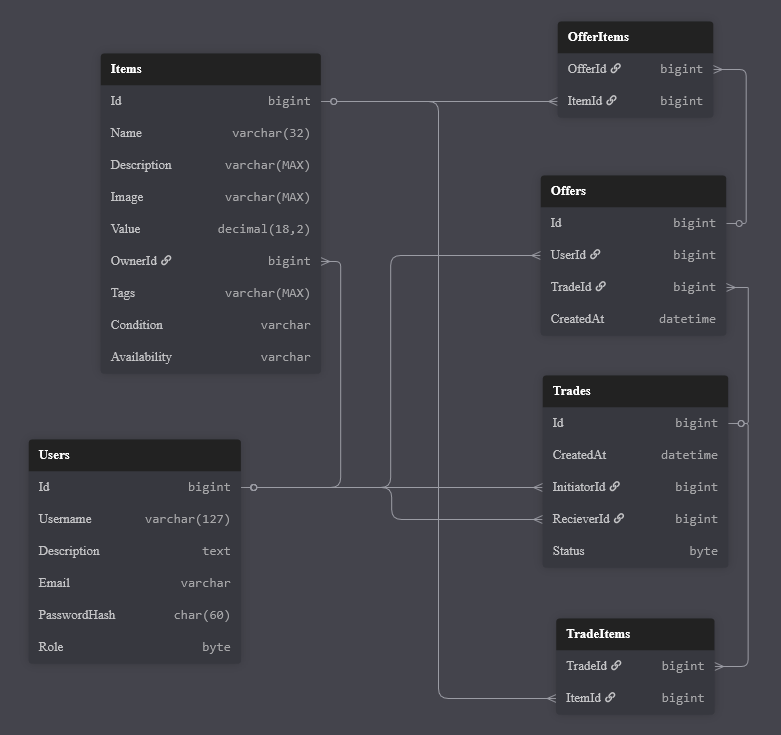
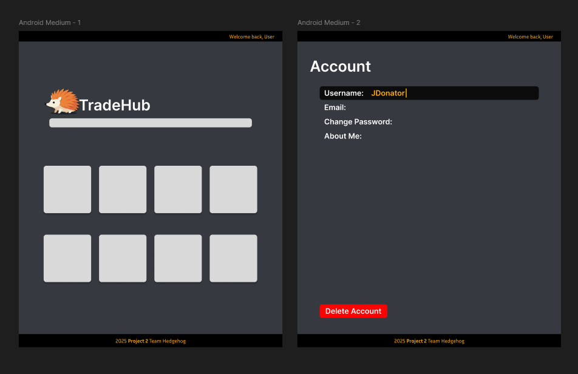

# Hedgehog Trade Hub

TradeHub is a sleek, intuitive platform designed to facilitate seamless peer-to-peer exchange of items. Whether you’re trading digital assets, collectibles, gaming items, or real-world goods, TradeHub offers a secure, user-friendly environment to negotiate, swap, and track trades. A user-friendly frontend written in Javascript with React allows for a easy and convenient user experience, while a controller-based API written in C# leveraging ASP.NET and EF Core running on a Kestrel server for full CRUD functionality. User data is stored in a SQL Server database in a Docker container, and user sessions are secured using JWTs and cookies for authorization and authentication. To start trading, users can create an account to create trades and add items to a trade, and when another user wants to trade for an item, they can create an offer and add their own items to it. As a bonus, users can choose to have the value of their item estimated by an LLM service, if they aren't sure of the exact value themselves.

## Progress Tracking

https://github.com/orgs/250908-NET/projects/2

## Endpoints

### Users

- [ ] GET /users - get all users (admin only?)
- [ ] POST /users - create new user
- [ ] POST /login - log in
- [ ] GET /users/me - get currently logged-in user(?)
- [ ] PATCH /users/me - modify currently logged-in user(?)
- [ ] GET /users/{UserId} - get specific user
- [ ] PATCH /users/{UserId} - modify specific user
- [ ] DELETE /users/{UserId} - delete user

### Items

- [X] GET /items - get all items (in active trades) (parameters as search terms)
- [X] POST /items - create new item
- [X] GET /items/{ItemId} - get specific item
- [X] PATCH /items/{ItemId} - modify item
- [X] DELETE /items/{ItemId} - delete item

### Trades

- [ ] GET /trades - get all trades (admin only?)
- [ ] POST /trades - create new trade
- [ ] GET /trades/{TradeId} - get info on specific trade
- [ ] DELETE /trades/{TradeId} - close trade
- [ ] POST /trades/{TradeId}/items - add items to trade
- [ ] DELETE /trades/{TradeId}/items/{ItemId} - remove item from trade

### Offers

- [ ] GET /trades/{TradeId}/offers - get all offers
- [ ] POST /trades/{TradeId}/offers - create new offer
- [ ] GET /trades/{TradeId}/offers/{OfferId} - get info on specific offer (and all attached items?)
- [ ] POST /trades/{TradeId}/offers/{OfferId} - add items to offer
- [ ] DELETE /trades/{TradeId}/offers/{OfferId}/items/{ItemId} - delete specific item from offer

## Requirements

### Application Architecture

- [X] Your code must be pushed to a project git repo on the cohort organization
- [X] Your application must build and run
- [X] Your application components must be loosely coupled, and exemplify a Service Oriented Architecture

### SQL Database

- [X] Your database must use MS SQL Server
- [X] Your database must run inside of a docker container
- [X] Your database should be in 3rd normal form
- [X] Your database should include at least one many-to-many relationship
- [X] Your database should be set up through an Entity Framework "Code-First" migration

### API

- [X] Your API must be written in C# for .NET
- [X] Your API must use the ASP.NET framework
- [X] Your API must exemplify the principles of REST
- [X] Your API must implement the Repository pattern for data persistance (multiple namespaces, interface)
- [X] Your API must implement SQL Server and Entity Framework Core to provide data persistance
- [X] Your API should fulfill all common CRUD functions
- [X] Your API should include proper exception handling
- [X] Your API should include logging with Serilog
- [X] Your API should include validation for any data being handled
- [ ] Your API should include at least 50% unit test coverage
  - To run: `dotnet test --collect:"XPlat Code Coverage" --results-directory ./CodeCoverage`
  - To generate report: `reportgenerator -reports:./CodeCoverage/**/*.cobertura.xml -targetdir:./CodeCoverage/Report -reporttypes:Html`
- [X] **Your API must implement an HTTP request to another API**
- [ ] **Your API must provide a cookie to the client**

### Frontend

- [X] Your frontend must be written in "vanilla JavaScript", with HTML5, CSS3, and JavaScript
- [X] Your frontend must interact with your API for data persistence
- [X] Your frontend may use the React library.
    - [X] If you choose to use React, your frontend must include at least three components, with at least one nested component. (At least one parent-child relationship, and at least one other unrelated component).
    - [X] Your components should include at least one component that implements `useState`.
    - [ ] Your components should include at least one component with props.
    - [ ] Your components should include at least one component that implements the `Context` hook.
- [X] Your frontend __may__ be built on the Node.js or Next.js frameworks.

### Non-Functional Requiremnts

- [X] Your project team should select a Team Lead to organize the development team efforts
- [ ] Your project should include a Project Description document which details:
    - [X] a description of the project
    - [X] at least five user stories for your applicaton
    - [X] a wireframe diagram of the UI
    - [X] an ERD (Entity Relationship Diagram) of the Database
    - [ ] unit test coverage reporting
    - [X] API endpoint documentation
- [X] Your project team should conduct a daily stand-up meeting
    - [ ] meeting notes should be kept to record development progress

### Project Presentation

- Project presentation will be done on Friday 10/10 afternoon.
- You should demo the application functionality by completing the planned user stories
- Your presentation should be about 10 minutes long, no longer than 15 minutes (at 20 min, you will be cut off so that there is time for everyone to present)

## ERD

## Wireframe

